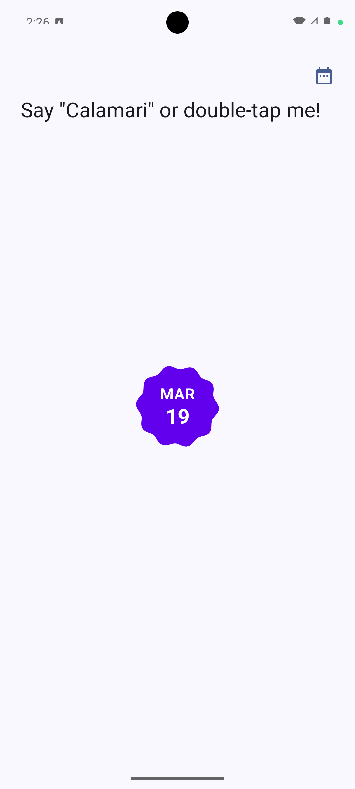
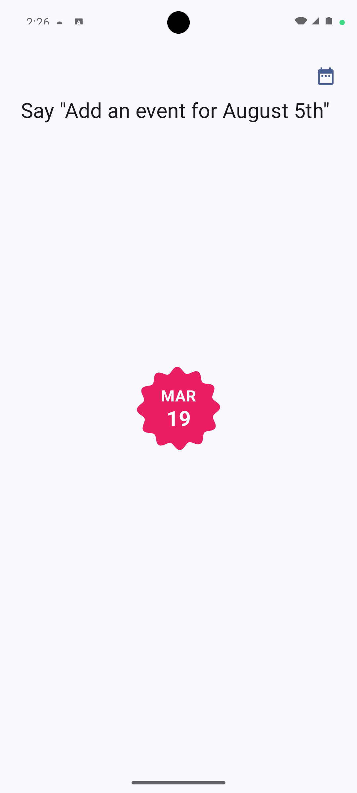
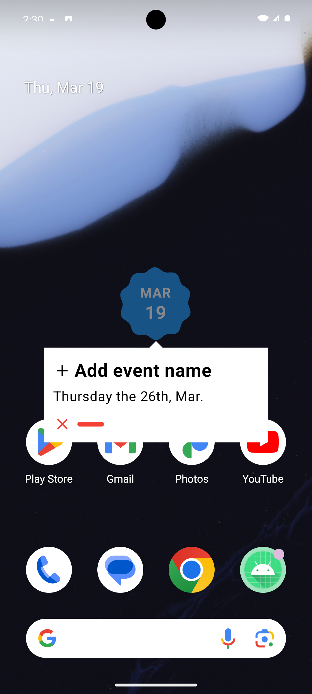
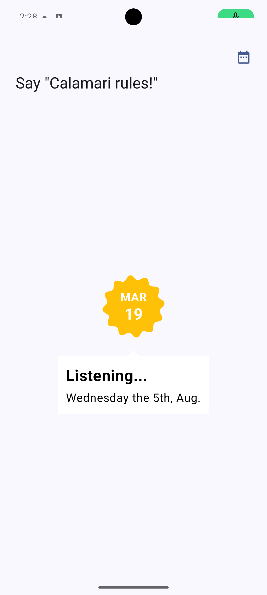
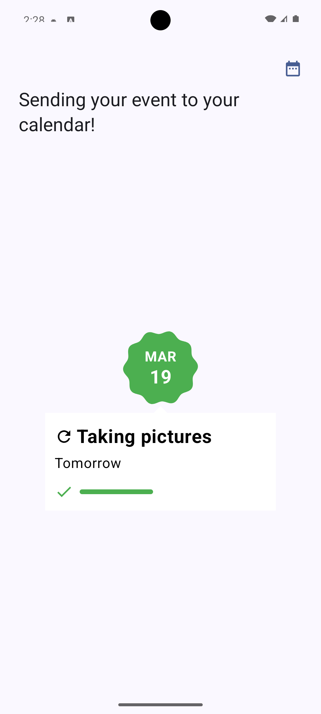
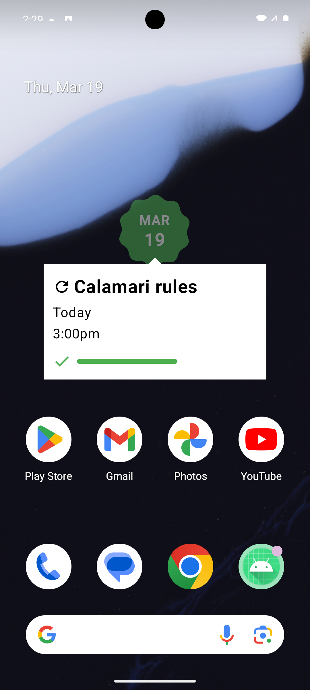

# Calamari

Calamari is a voice-driven Android companion that runs an always-on floating “bubble” overlay. The bubble listens for the user’s hot word and intents, guides the user through creating calendar events, and provides a Home screen UI for viewing those created events.

## Features

- Floating overlay bubble for voice interaction.
- Permission-gated onboarding (calendar, microphone, and overlay permissions).
- Home screen with a calendar button.
- Bottom sheet listing events created by Calamari.
- Event deep-link behavior:
  - Events created **within the last 24 hours** open the user’s default calendar view (no deep link).
  - Events created **24+ hours ago** attempt to open the specific event by `eventId`.
  - Events flagged as **Deleted** (missing from the system calendar) show a deleted indicator and are non-interactive.

## Screens

- **Overlay bubble**: captures voice input and guides the user through event creation.
- **Home events bottom sheet**: lists cached events with title/date/time (and an “all-day” fallback).
- **Event prompt**: appears when an event intent is recognized, then transitions through title capture and submission.

## Screenshots

The flow below is organized to mirror the typical user journey through the app.

Demo video: [View `.webm` recording](docs/Screen_recording_20260319_235724.webm)

1) Idle / wake-word ready:

2) Listening for event details:

3) Parsed date/intent confirmation (prompt context before title capture):

4) Listening for event title:

5) Ready to submit:

6) Submission while overlay is above other apps:

## How it works (high level)

1. The overlay service runs and listens for voice intents.
2. Calendar event timing is computed and an event prompt is shown for title capture.
3. When the user submits, events are inserted into the system calendar provider.
4. The repository persists a bounded history of Calamari-created events in a local Room database, which powers the Home bottom sheet.

## Notes & Thoughts

I focused on calendar event creation because it is a frequent “small-friction” task: you are in another app, see or hear a date, and have to switch context, memorize details, then manually add it later. Voice is a strong fit here because scheduling is naturally conversational ("create an event for Friday at 3 PM"), and the app can be triggered hands-free from any screen through the floating bubble.

At runtime, the architecture is primarily on-device:
- **Audio capture + intent parsing:** Picovoice (Porcupine) processes live audio chunks, detects the hot word ("Calamari"), then (Rhino) extracts date/time intent slots.
- **Title capture:** after date/time intent is captured, Android `SpeechRecognizer` is used for free-form event titles with offline preference enabled, so recognition can run locally when offline language models are available on the device.
- **Android APIs:** `CalendarContract` is used to create events in the user's default calendar.
- **Persistence + reliability:** Room stores created-event history locally, and WorkManager periodically verifies whether stored `eventId`s still exist in the system calendar so deleted items can be flagged in UI.

Prompt/model integration was mostly schema-first. Picovoice makes this practical with a console-driven grammar/slot model (intent inference), not a general-purpose LLM. The important part was designing phrase templates and slot groups that extract useful structure while still feeling natural to users. A phrase such as:
`Create an event for Friday the 13th at 12 PM`
is modeled as a sequence of optional phrase tokens plus value slots (day/date/time/daytime), then normalized into typed app models before conversion to epoch millis for `CalendarContract`.

I also explored Gemini AI Edge. The approach was promising, but practical validation in my setup was blocked by hardware constraints (no physical Android device available for reliable on-device microphone-driven model testing). Because of that, Picovoice was the most reliable path to deliver a complete working app in this project scope.

Codebase walkthrough:
- `overlay/`: floating bubble lifecycle, state machine, prompt behavior, and service orchestration (`MainBubbleService`).
- `audio/`: speech pipeline and intent modeling (`CalamariAudioEngine`, `CalamariIntent` models).
- `calendar/`: date/time conversion utilities, calendar writes, Room history storage, and verification worker.
- `activity/home/`: Home UI and event history bottom sheet (`HomeScreen`, `EventsSheet`, `HomeViewModel`, `SplashScreen`).
- `activity/permissions/`: permission policy, onboarding screens, and permission-specific viewmodels.
- `activity/navigation/`: route definitions and permission->route mapping.
- `activity/theme/`: Compose theme/color/typography definitions used by activity-layer UI.
- `activity/MainActivity`: top-level navigation host and app-level screen flow.
- `di/`: Hilt modules and dependency wiring.
- `CalamariApp`: application entrypoint and global app configuration.

If I continued this project, I'd unify calendar/date utility logic, tighten package boundaries between repositories and helpers, and add on-device validation scripts backed by a small device farm to verify real microphone-driven input/output behavior. The current structure remains approachable for a small app.

